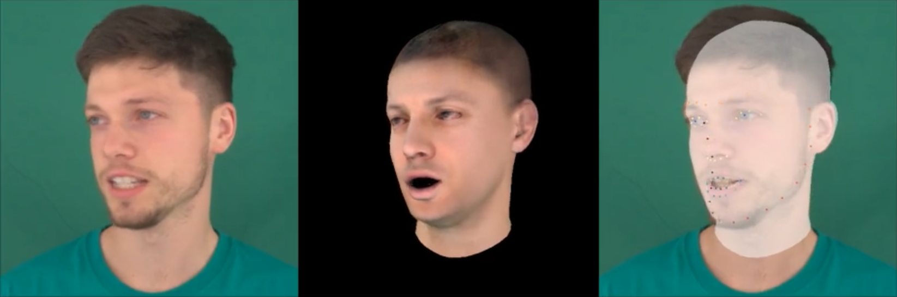

# Video Head Tracker


<br><br>
A Python library for tracking a human head across a video sequence with 
[FLAME](https://flame.is.tue.mpg.de/) (a 3D morphable head model) in 3D.
The tracking algorithm is inspired by [face2face](https://openaccess.thecvf.com/content_cvpr_2016/papers/Thies_Face2Face_Real-Time_Face_CVPR_2016_paper.pdf).
It determines FLAMEs shape and texture parameters as well as spherical harmonics lights and 
camera intrinsics for the whole sequence. Afterwards, expressions and poses (rigid, neck, jaw, eyes) 
are optimized for each frame. The only inputs are an RGB video together with facial and iris landmarks.
The latter is estimated by our code automatically.

This repository complements the code release of the CVPR2022 paper 
[Neural Head Avatars from Monocular RGB Videos](https://philgras.github.io/neural_head_avatars/neural_head_avatars.html).
The code is maintained independently from the paper's code to ease reusing it in other projects.

## Installation
- Install Python 3.9 (it should work with other versions as well, but the setup.py and 
    dependencies must be adjusted to do so).
- Clone the repo and run ```pip install -e .``` from inside the cloned directory.
- Download the flame head model and texture space from the from the 
official [website](https://flame.is.tue.mpg.de/) and add them as ```generic_model.pkl``` and 
```FLAME_texture.npz``` under ```./assets/flame```.
- Finally, go to ```https://github.com/HavenFeng/photometric_optimization``` and copy the uv
parametrization ```head_template_mesh.obj``` of FLAME found 
[there](https://github.com/HavenFeng/photometric_optimization/blob/master/data/head_template_mesh.obj)
to ```./assets/flame```, as well.

## Usage
To run the tracker on a video run
```
python vht/optimize_tracking.py --config your_config.ini --video path_to_video --data_path path_to_data
```
The video path and data path can also be given inside the config file. In general, all parameters
in the config file may be overwritten by providing them on the command line explicitly.
If a video path is given, the video will be extracted and facial + iris landmarks are predicted for
each frame. The frames and landmarks are stored at ```--data_path```. Once extracted, you can reuse 
them by not passing the ```--video``` flag anymore.
We provide config file for two identities tracked in the main paper. The video data for these
subjects can be downloaded from the paper [repository](https://github.com/philgras/neural-head-avatars).
These configs provide good defaults for other videos, as well.

If you would like to use your own videos, the following parameters are most important to set:
```
[dataset]
data_path = PATH_TO_DATASET --> discussed above
tracking_resolution = [height, width] --> resolution to track

[training]
output_path = OUTPUT_PATH --> where the results will be stored
keyframes = [90, 415, 434, 193] --> list of frames used to optimize shape, texture, lights and camera
                                --> ideally, you provide one front, one left and one right view
```

The optimized parameters are stored in the output directory as ```tracked_flame_params.npz```.

## License
The code is available for non-commercial scientific research purposes under the 
[CC BY-NC 3.0 license](https://creativecommons.org/licenses/by-nc/3.0/legalcode).
 Please note that the files [flame.py](./nha/models/flame.py) and [lbs.py](./nha/util/lbs.py) 
 are heavily inspired by https://github.com/HavenFeng/photometric_optimization and are property 
 of the Max-Planck-Gesellschaft zur Förderung der Wissenschaften e.V. 
 The download, use, and distribution of this code is subject to this
 [license](https://github.com/vchoutas/smplx/blob/master/LICENSE). 
 The files that can be found in the [./assets](./assets) directory, 
 are adapted from the [FLAME head model](https://flame.is.tue.mpg.de) 
 for which the license can be found [here](https://flame.is.tue.mpg.de/modellicense.html).

## Citation 
**If you find our work useful, please include the following citation:**

```
@article{grassal2021neural,
  title={Neural Head Avatars from Monocular RGB Videos},
  author={Grassal, Philip-William and Prinzler, Malte and Leistner, Titus and Rother, Carsten
          and Nie{\ss}ner, Matthias and Thies, Justus},
  journal={arXiv preprint arXiv:2112.01554},
  year={2021}
}
```

## Acknowledgements 
This project has received funding from the DFG in the joint 
German-Japan-France grant agreement (RO 4804/3-1) and the ERC Starting Grant Scan2CAD (804724).
We also thank the Center for Information Services and High Performance Computing (ZIH) at TU Dresden
for generous allocations of computer time.

